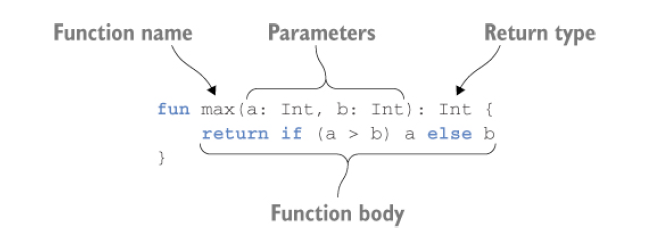

# Kotlin

Target Platforms: server side, android, anywhere java runs

Kotlin primary goal is to provide a more concise, more productive,
safer alternative to java suitable in all context where JAVA is used.

Common areas Kotlin is used:
- server side codes
- mobile applications that run on android

#### Kotlin is Statically Typed

Statically typed programming language means the type of every
expression must be known at compile type and the compiler

### KOTLIN FUNCTION DECLARATION
